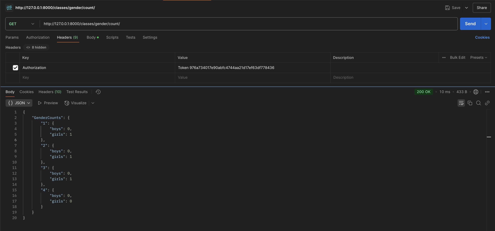

### Руководство по использованию API для управления школьными данными

---

#### 1. **Регистрация пользователя**
- **URL:** `/auth/users/`
- **Метод:** `POST`

**Запрос:**
```http
POST /auth/users/
Content-Type: application/json

{
  "username": "newuser",
  "password": "password123",
  "email": "newuser@example.com"
}
```


---

#### 2. **Получение токена авторизации**
- **URL:** `/auth/token/login/`
- **Метод:** `POST`

**Запрос:**
```http
POST /auth/token/login/
Content-Type: application/json

{
  "username": "newuser",
  "password": "password123"
}
```


---

#### 3. **Получение информации о текущем пользователе**
- **URL:** `/auth/users/me/`
- **Метод:** `GET`

**Запрос:**
```http
GET /auth/users/me/
Authorization: Token abc123xyz456token
```


---

### Работа с API

#### 1. **Управление учителями**
- **Добавление учителя**
  - **URL:** `/teachers/`
  - **Метод:** `POST`

**Запрос:**
```http
GET /teachers/
Authorization: Token abc123xyz456token
Content-Type: application/json
```


```python
class TeacherAPIView(GenericAPIView):
    permission_classes = [IsAuthenticated]
    serializer_class = TeacherSerializer
    queryset = Teacher.objects.all()

    def get(self, request, teacher_id=None, *args, **kwargs):
        if teacher_id:
            try:
                teacher = Teacher.objects.get(id=teacher_id)
                serializer = self.serializer_class(teacher)
                return Response({"Teacher": serializer.data})
            except Teacher.DoesNotExist:
                return Response({"Error": "Teacher not found."}, status=status.HTTP_404_NOT_FOUND)
        else:
            teachers = Teacher.objects.all()
            serializer = self.serializer_class(teachers, many=True)
            return Response({"Teachers": serializer.data})
```

---

#### 2. **Получение списка студентов**
- **URL:** `/students/`
- **Метод:** `GET`

**Запрос:**
```http
GET /students/
Authorization: Token abc123xyz456token
```


```python
class StudentAPIView(GenericAPIView):
    permission_classes = [IsAuthenticated]
    serializer_class = StudentSerializer
    queryset = Student.objects.all()

    def get(self, request, student_id=None, *args, **kwargs):
        if student_id:
            try:
                student = Student.objects.get(id=student_id)
                serializer = self.serializer_class(student)
                return Response({"Student": serializer.data})
            except Student.DoesNotExist:
                return Response({"Error": "Student not found."}, status=status.HTTP_404_NOT_FOUND)
        else:
            students = Student.objects.all()
            serializer = self.serializer_class(students, many=True)
            return Response({"Students": serializer.data})
```

---

#### 3. **Получение информации о предмете для заданного урока**
- **URL:** `/class/<klass_id>/<weekday>/<lesson_number>/subject/`
- **Метод:** `GET`

**Запрос:**
```http
GET /class/1/Monday/1/subject/
Authorization: Token abc123xyz456token
```


```python
class SubjectInClassAPIView(APIView):
    permission_classes = [IsAuthenticated]

    def get(self, request, klass_id, weekday, lesson_number):
        try:
            lesson = Lesson.objects.get(klass_id=klass_id, weekday=weekday, lesson_number=lesson_number)
            subject_name = lesson.subject.name
            return Response({"Subject": subject_name})
        except Lesson.DoesNotExist:
            return Response({"Error": "Lesson not found."}, status=404)
```

---

#### 4. **Отчет о преподавателях**
- **URL:** `/subjects/teachers/count/`
- **Метод:** `GET`

**Запрос:**
```http
GET /subjects/teachers/count/
Authorization: Token abc123xyz456token
```


```python
class TeachersPerSubjectAPIView(APIView):
    permission_classes = [IsAuthenticated]

    def get(self, request):
        teachers_count = Teacher.objects.values('subject__name').annotate(count=Count('id'))
        data = {entry['subject__name']: entry['count'] for entry in teachers_count}
        return Response({"TeachersPerSubject": data})
```

---

#### 5. **Отчет о мальчиках и девочках в каждом классе**
- **URL:** `/classes/gender/count/`
- **Метод:** `GET`

**Запрос:**
```http
GET /classes/gender/count/
Authorization: Token abc123xyz456token
```



```python
class GenderCountInClassesAPIView(APIView):
    permission_classes = [IsAuthenticated]

    def get(self, request):
        classes = Klass.objects.all()
        data = {}
        for klass in classes:
            boys = Student.objects.filter(klass=klass, gender="Male").count()
            girls = Student.objects.filter(klass=klass, gender="Female").count()
            data[klass.id] = {"boys": boys, "girls": girls}
        return Response({"GenderCounts": data})
```

---

#### 6. **Отчет по кабинетам для базовых и профильных дисциплин**
- **URL:** `/classrooms/count/`
- **Метод:** `GET`

**Запрос:**
```http
GET /classrooms/count/
Authorization: Token abc123xyz456token
```


```python
class ClassroomCountAPIView(APIView):
    permission_classes = [IsAuthenticated]

    def get(self, request):
        classrooms = Classroom.objects.values('type').annotate(count=Count('id'))
        data = {entry['type']: entry['count'] for entry in classrooms}
        return Response({"ClassroomCounts": data})
```

---

#### 7. **Получение отчета об успеваемости класса**
- **URL:** `/class/<klass_id>/performance/`
- **Метод:** `GET`

**Запрос:**
```http
GET /class/5/performance/
Authorization: Token abc123xyz456token
```


```python
class ClassPerformanceAPIView(APIView):
    permission_classes = [IsAuthenticated]

    def get(self, request, klass_id):
        try:
            klass = Klass.objects.get(id=klass_id)
            students = Student.objects.filter(klass__id=klass_id)
            grades = QuarterGrade.objects.filter(student__klass__id=klass_id)
            subjects = Subject.objects.all()
            report = {}

            for subject in subjects:
                subject_grades = grades.filter(subject=subject)
                if subject_grades.exists():
                    avg_grade = subject_grades.aggregate(avg=Avg('grade'))['avg']
                    report[subject.name] = {
                        "average_grade": avg_grade,
                        "grades": QuarterGradeSerializer(subject_grades, many=True).data
                    }

            class_teacher = klass.class_teacher
            class_teacher_data = TeacherSerializer(class_teacher).data if class_teacher else None
            total_students = students.count()

            response_data = {
                "class_teacher": class_teacher_data,
                "total_students": total_students,
                "report": report
            }

            return Response(response_data)

        except Klass.DoesNotExist:
            return Response({"Error": "Class not found."}, status=status.HTTP_404_NOT_FOUND)
```

---

### Swagger документация
Для визуализации и тестирования API используется Swagger UI:

- **URL:** `/doc/swagger/`
- Открывает интерфейс с подробной документацией всех эндпоинтов и их тестирование в браузере.


---