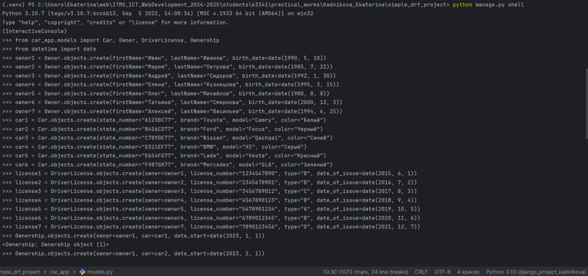
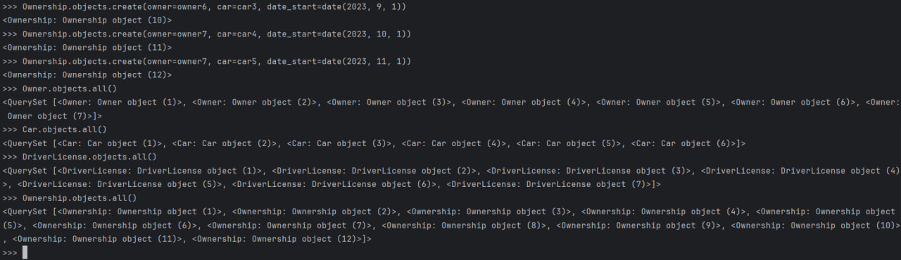
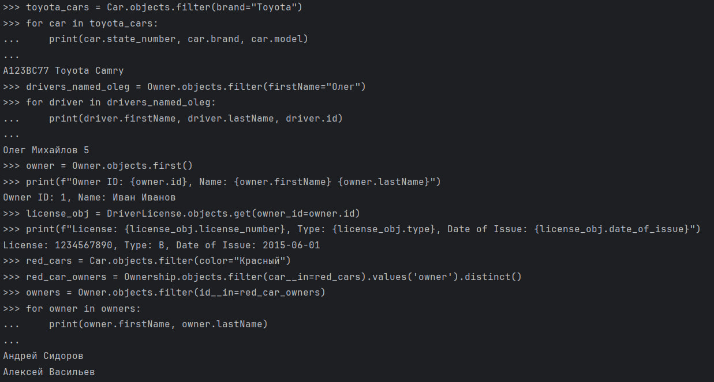
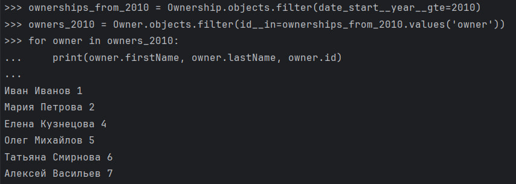
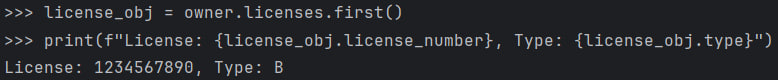
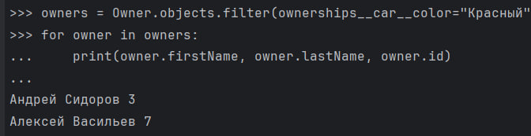
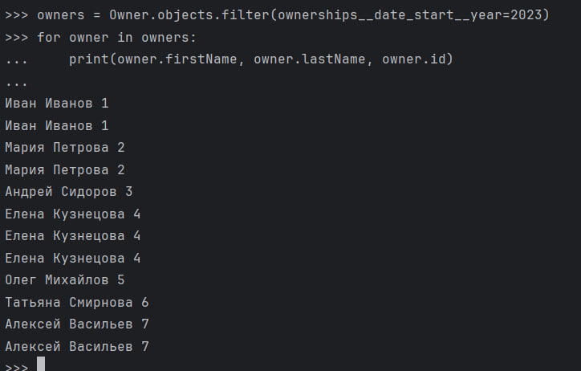
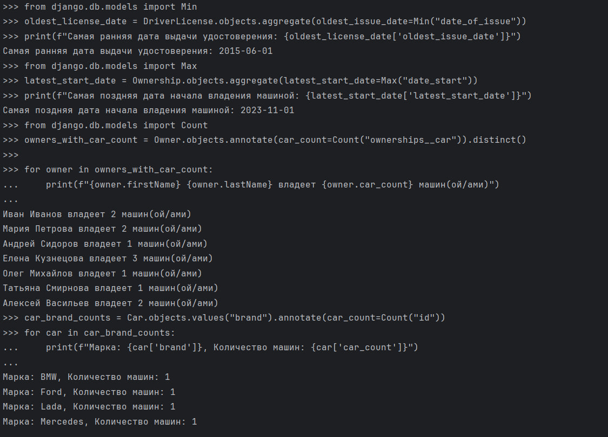
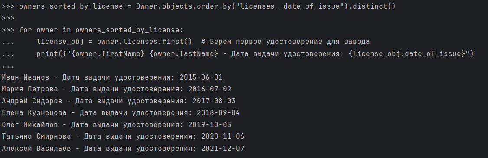

### Задание 1

Напишите запрос на создание 6-7 новых автовладельцев и 5-6 автомобилей, каждому автовладельцу назначьте удостоверение и от 1 до 3 автомобилей. Задание можете выполнить либо в интерактивном режиме интерпретатора, либо в отдельном python-файле. Результатом должны стать запросы и отображение созданных объектов.

```python
(.venv) PS C:\Users\Ekaterina\web\ITMO_ICT_WebDevelopment_2024-2025\students\k3341\practical_works\Kadnikova_Ekaterina\simple_drf_project> python manage.py shell
Python 3.10.7 (tags/v3.10.7:6cc6b13, Sep  5 2022, 14:08:36) [MSC v.1933 64 bit (AMD64)] on win32
Type "help", "copyright", "credits" or "license" for more information.
(InteractiveConsole)
>>> from car_app.models import Car, Owner, DriverLicense, Ownership
>>> from datetime import date
>>> owner1 = Owner.objects.create(firstName="Иван", lastName="Иванов", birth_date=date(1990, 5, 10))
>>> owner2 = Owner.objects.create(firstName="Мария", lastName="Петрова", birth_date=date(1985, 7, 22))
>>> owner3 = Owner.objects.create(firstName="Андрей", lastName="Сидоров", birth_date=date(1992, 1, 30))
>>> owner4 = Owner.objects.create(firstName="Елена", lastName="Кузнецова", birth_date=date(1995, 3, 15))
>>> owner5 = Owner.objects.create(firstName="Олег", lastName="Михайлов", birth_date=date(1988, 8, 8))
>>> owner6 = Owner.objects.create(firstName="Татьяна", lastName="Смирнова", birth_date=date(2000, 12, 3))
>>> owner7 = Owner.objects.create(firstName="Алексей", lastName="Васильев", birth_date=date(1994, 6, 25))
>>> car1 = Car.objects.create(state_number="A123BC77", brand="Toyota", model="Camry", color="Белый")
>>> car2 = Car.objects.create(state_number="B456CD77", brand="Ford", model="Focus", color="Черный")
>>> car3 = Car.objects.create(state_number="C789DE77", brand="Nissan", model="Qashqai", color="Синий")
>>> car4 = Car.objects.create(state_number="D321EF77", brand="BMW", model="X5", color="Серый")
>>> car5 = Car.objects.create(state_number="E654FG77", brand="Lada", model="Vesta", color="Красный")
>>> car6 = Car.objects.create(state_number="F987GH77", brand="Mercedes", model="GLA", color="Зеленый")
>>> license1 = DriverLicense.objects.create(owner=owner1, license_number="1234567890", type="B", date_of_issue=date(2015, 6, 1))
>>> license2 = DriverLicense.objects.create(owner=owner2, license_number="2345678901", type="B", date_of_issue=date(2016, 7, 2))
>>> license3 = DriverLicense.objects.create(owner=owner3, license_number="3456789012", type="C", date_of_issue=date(2017, 8, 3))
>>> license4 = DriverLicense.objects.create(owner=owner4, license_number="4567890123", type="B", date_of_issue=date(2018, 9, 4))
>>> license5 = DriverLicense.objects.create(owner=owner5, license_number="5678901234", type="A", date_of_issue=date(2019, 10, 5))
>>> license6 = DriverLicense.objects.create(owner=owner6, license_number="6789012345", type="B", date_of_issue=date(2020, 11, 6))
>>> license7 = DriverLicense.objects.create(owner=owner7, license_number="7890123456", type="D", date_of_issue=date(2021, 12, 7))
>>> Ownership.objects.create(owner=owner1, car=car1, date_start=date(2023, 1, 1))
<Ownership: Ownership object (1)>
>>> Ownership.objects.create(owner=owner1, car=car2, date_start=date(2023, 2, 1))
<Ownership: Ownership object (2)>
>>> Ownership.objects.create(owner=owner2, car=car3, date_start=date(2023, 3, 1))
<Ownership: Ownership object (3)>
>>> Ownership.objects.create(owner=owner2, car=car4, date_start=date(2023, 4, 1))
<Ownership: Ownership object (4)>
>>> Ownership.objects.create(owner=owner3, car=car5, date_start=date(2023, 5, 1))
<Ownership: Ownership object (5)>
>>> Ownership.objects.create(owner=owner4, car=car6, date_start=date(2023, 6, 1))
<Ownership: Ownership object (6)>
>>> Ownership.objects.create(owner=owner4, car=car6, date_start=date(2023, 6, 1))
<Ownership: Ownership object (7)>
>>> Ownership.objects.create(owner=owner4, car=car1, date_start=date(2023, 7, 1))
<Ownership: Ownership object (8)>
>>> Ownership.objects.create(owner=owner5, car=car2, date_start=date(2023, 8, 1))
<Ownership: Ownership object (9)>
>>> Ownership.objects.create(owner=owner6, car=car3, date_start=date(2023, 9, 1))
<Ownership: Ownership object (10)>
>>> Ownership.objects.create(owner=owner7, car=car4, date_start=date(2023, 10, 1))
<Ownership: Ownership object (11)>
>>> Ownership.objects.create(owner=owner7, car=car5, date_start=date(2023, 11, 1))
<Ownership: Ownership object (12)>
>>> Owner.objects.all()
<QuerySet [<Owner: Owner object (1)>, <Owner: Owner object (2)>, <Owner: Owner object (3)>, <Owner: Owner object (4)>, <Owner: Owner object (5)>, <Owner: Owner object (6)>, <Owner: Owner object (7)>]>
>>> Car.objects.all()
<QuerySet [<Car: Car object (1)>, <Car: Car object (2)>, <Car: Car object (3)>, <Car: Car object (4)>, <Car: Car object (5)>, <Car: Car object (6)>]>
>>> DriverLicense.objects.all()
<QuerySet [<DriverLicense: DriverLicense object (1)>, <DriverLicense: DriverLicense object (2)>, <DriverLicense: DriverLicense object (3)>, <DriverLicense: DriverLicense object (4)>, <DriverLicense: DriverLicense object (5)>, <DriverLicense: DriverLicense object (6)>, <DriverLicense: DriverLicense object (7)>]>
>>> Ownership.objects.all()
<QuerySet [<Ownership: Ownership object (1)>, <Ownership: Ownership object (2)>, <Ownership: Ownership object (3)>, <Ownership: Ownership object (4)>, <Ownership: Ownership object (5)>, <Ownership: Ownership object (6)>, <Ownership: Ownership object (7)>, <Ownership: Ownership object (8)>, <Ownership: Ownership object (9)>, <Ownership: Ownership object (10)>, <Ownership: Ownership object (11)>, <Ownership: Ownership object (12)>]>
```




### Задание 2

По созданным в пр.1 данным написать следующие запросы на фильтрацию:

* Где это необходимо, добавьте related_name к полям модели
* Выведете все машины марки “Toyota” (или любой другой марки, которая у вас есть)
* Найти всех водителей с именем “Олег” (или любым другим именем на ваше усмотрение)
* Взяв любого случайного владельца получить его id, и по этому id получить экземпляр удостоверения в виде объекта модели (можно в 2 запроса)
* Вывести всех владельцев красных машин (или любого другого цвета, который у вас присутствует)
* Найти всех владельцев, чей год владения машиной начинается с 2010 (или любой другой год, который присутствует у вас в базе)

```python
>>> toyota_cars = Car.objects.filter(brand="Toyota")
>>> for car in toyota_cars:
...     print(car.state_number, car.brand, car.model)
...
A123BC77 Toyota Camry
>>> drivers_named_oleg = Owner.objects.filter(firstName="Олег")
>>> for driver in drivers_named_oleg:
...     print(driver.firstName, driver.lastName, driver.id)
...
Олег Михайлов 5
>>> owner = Owner.objects.first()
>>> print(f"Owner ID: {owner.id}, Name: {owner.firstName} {owner.lastName}")
Owner ID: 1, Name: Иван Иванов
>>> license_obj = DriverLicense.objects.get(owner_id=owner.id)
>>> print(f"License: {license_obj.license_number}, Type: {license_obj.type}, Date of Issue: {license_obj.date_of_issue}")
License: 1234567890, Type: B, Date of Issue: 2015-06-01
>>> owner = Owner.objects.first()
>>> license_obj = owner.licenses.first()
>>> print(f"License: {license_obj.license_number}, Type: {license_obj.type}")
License: 1234567890, Type: B
>>> owners = Owner.objects.filter(ownerships__car__color="Красный")
>>> for owner in owners:
...     print(owner.firstName, owner.lastName, owner.id)
...
Андрей Сидоров 3
Алексей Васильев 7
>>> owners = Owner.objects.filter(ownerships__date_start__year=2023)
>>> for owner in owners:
...     print(owner.firstName, owner.lastName, owner.id)
...
Иван Иванов 1
Иван Иванов 1
Мария Петрова 2
Мария Петрова 2
Андрей Сидоров 3
Елена Кузнецова 4
Елена Кузнецова 4
Елена Кузнецова 4
Олег Михайлов 5
Татьяна Смирнова 6
Алексей Васильев 7
Алексей Васильев 7
```







### Задание 3

Необходимо реализовать следующие запросы c применением описанных методов:
* Вывод даты выдачи самого старшего водительского удостоверения
* Укажите самую позднюю дату владения машиной, имеющую какую-то из существующих моделей в вашей базе
* Выведите количество машин для каждого водителя
* Подсчитайте количество машин каждой марки
* Отсортируйте всех автовладельцев по дате выдачи удостоверения (Примечание: чтобы не выводить несколько раз одни и те же таблицы воспользуйтесь методом .distinct()

```python
>>> from django.db.models import Min
>>> oldest_license_date = DriverLicense.objects.aggregate(oldest_issue_date=Min("date_of_issue"))
>>> print(f"Самая ранняя дата выдачи удостоверения: {oldest_license_date['oldest_issue_date']}")
Самая ранняя дата выдачи удостоверения: 2015-06-01
>>> from django.db.models import Max
>>> latest_start_date = Ownership.objects.aggregate(latest_start_date=Max("date_start"))
>>> print(f"Самая поздняя дата начала владения машиной: {latest_start_date['latest_start_date']}")
Самая поздняя дата начала владения машиной: 2023-11-01
>>> from django.db.models import Count
>>> owners_with_car_count = Owner.objects.annotate(car_count=Count("ownerships__car")).distinct()
>>>
>>> for owner in owners_with_car_count:
...     print(f"{owner.firstName} {owner.lastName} владеет {owner.car_count} машин(ой/ами)")
...
Иван Иванов владеет 2 машин(ой/ами)
Мария Петрова владеет 2 машин(ой/ами)
Андрей Сидоров владеет 1 машин(ой/ами)
Елена Кузнецова владеет 3 машин(ой/ами)
Олег Михайлов владеет 1 машин(ой/ами)
Татьяна Смирнова владеет 1 машин(ой/ами)
Алексей Васильев владеет 2 машин(ой/ами)
>>> car_brand_counts = Car.objects.values("brand").annotate(car_count=Count("id"))
>>> for car in car_brand_counts:
...     print(f"Марка: {car['brand']}, Количество машин: {car['car_count']}")
...
Марка: BMW, Количество машин: 1
Марка: Ford, Количество машин: 1
Марка: Lada, Количество машин: 1
Марка: Mercedes, Количество машин: 1
Марка: Nissan, Количество машин: 1
Марка: Toyota, Количество машин: 1
>>> owners_sorted_by_license = Owner.objects.order_by("licenses__date_of_issue").distinct()
>>>
>>> for owner in owners_sorted_by_license:
...     license_obj = owner.licenses.first()
...     print(f"{owner.firstName} {owner.lastName} - Дата выдачи удостоверения: {license_obj.date_of_issue}")
...
Иван Иванов - Дата выдачи удостоверения: 2015-06-01
Мария Петрова - Дата выдачи удостоверения: 2016-07-02
Андрей Сидоров - Дата выдачи удостоверения: 2017-08-03
Елена Кузнецова - Дата выдачи удостоверения: 2018-09-04
Олег Михайлов - Дата выдачи удостоверения: 2019-10-05
Татьяна Смирнова - Дата выдачи удостоверения: 2020-11-06
Алексей Васильев - Дата выдачи удостоверения: 2021-12-07
```


