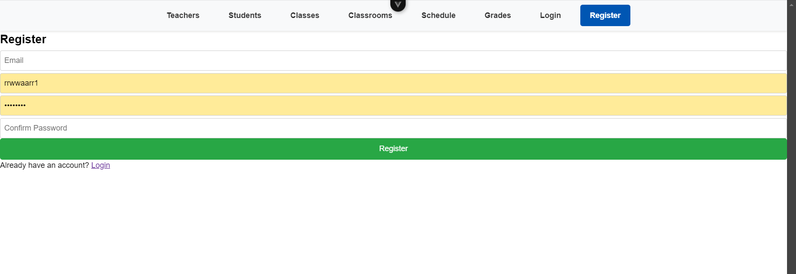
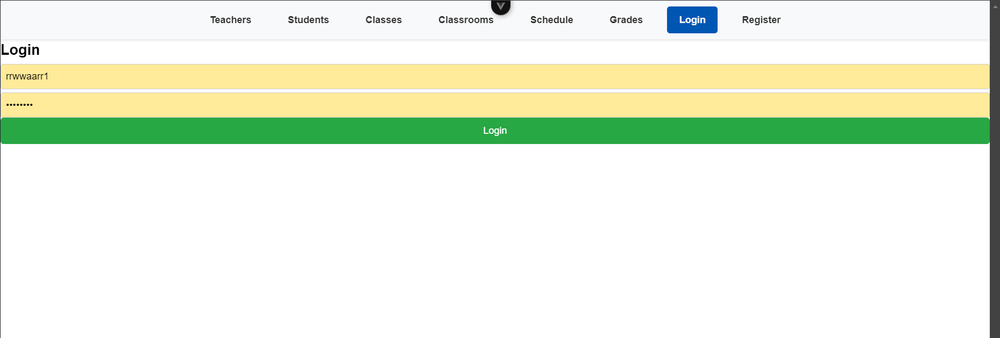
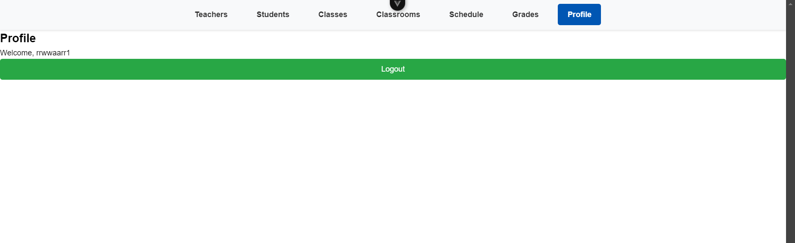
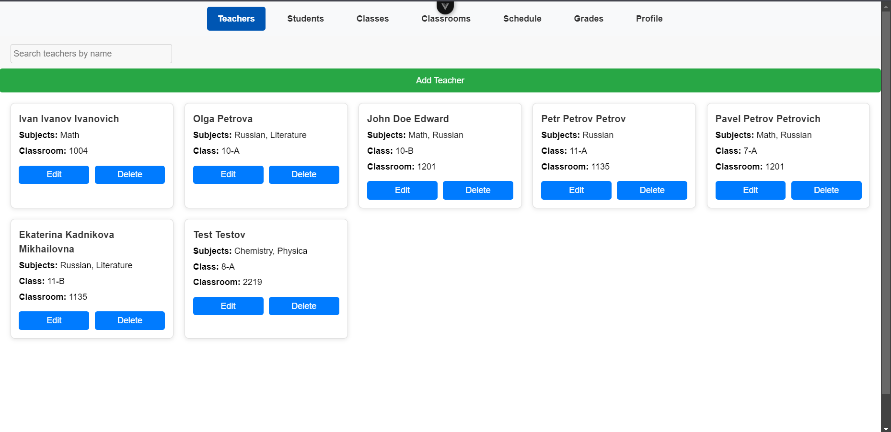
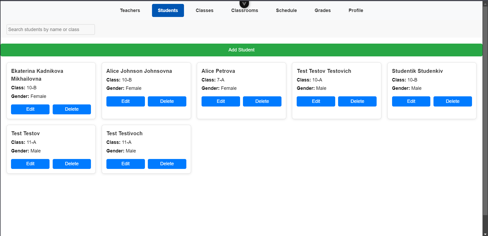
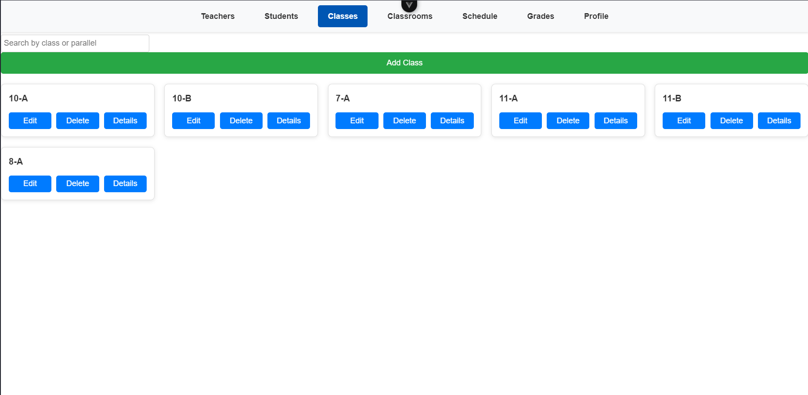
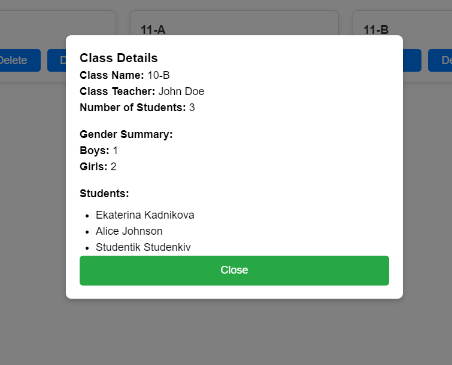
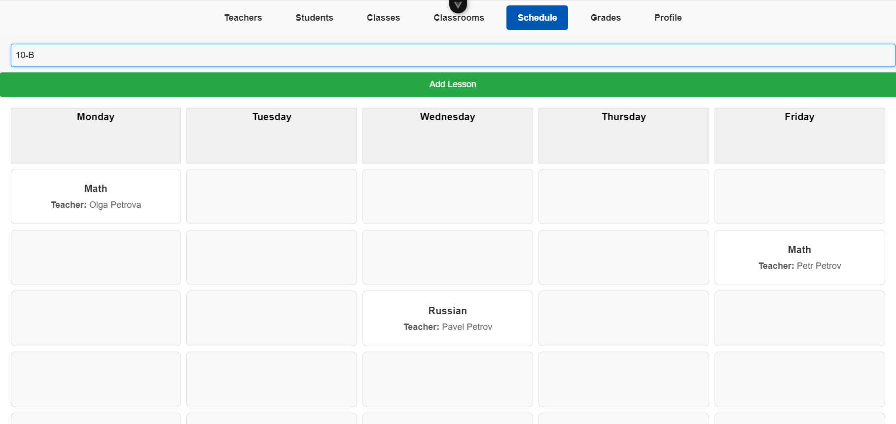
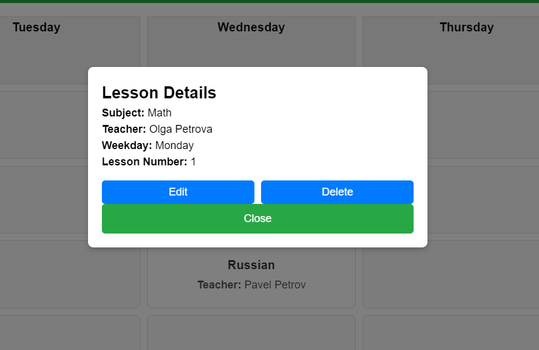
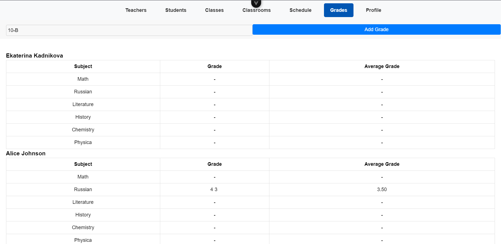

# Выполнение лабораторной работы №4


## 1. **Регистрация/авторизация**

Для возможности работы со всеми сущностями системы необходим войти или зарегестрироваться:

### 1.1 Регистрация



```python
<template>
  <div class="container">
    <h2>Register</h2>
    <form @submit.prevent="register">
      <input v-model="email" placeholder="Email" type="email" required />
      <input v-model="username" placeholder="Username" type="text" required />
      <input v-model="password" placeholder="Password" type="password" required />
      <input v-model="re_password" placeholder="Confirm Password" type="password" required />
      <button type="submit">Register</button>
    </form>
    <footer>
      <p>Already have an account? <RouterLink to="/login">Login</RouterLink></p>
    </footer>
  </div>
</template>

<script>
import API from "@/axios";

export default {
  data() {
    return {
      email: "",
      username: "",
      password: "",
      re_password: "",
    };
  },
  methods: {
    async register() {
      try {
        await API.post('/auth/users/', {
          email: this.email,
          username: this.username,
          password: this.password,
          re_password: this.re_password,
        });
        this.$router.push('/login');
      } catch (error) {
        console.error(error);
      }
    },
  },
};
</script>

<style scoped>
@import "@/assets/styles.css";
</style>

```
---

### 1.2 Логин




```python
<template>
  <div>
    <h2>Login</h2>
    <form @submit.prevent="login">
      <input v-model="username" placeholder="Username" type="text" required />
      <input v-model="password" placeholder="Password" type="password" required />
      <button type="submit">Login</button>
    </form>
  </div>
</template>

<script>
import API from "@/axios";
import TokenStore from "../stores/token.ts";

export default {
  data() {
    return {
      username: "",
      password: "",
    };
  },
  methods: {
    async login() {
      try {
        const response = await API.post('/auth/token/login/', {
          username: this.username,
          password: this.password,
        });
        TokenStore.setToken(response.data.auth_token);
        console.log('Token saved:', TokenStore.getToken());
        //localStorage.setItem('token', response.data.auth_token);
        //console.log('Token:', localStorage.getItem('token'));
        this.$emit('login');
        this.$router.push('/profile');
      } catch (error) {
        console.error(error);
      }
    },
  },
};
</script>

<style scoped>
@import "@/assets/styles.css";
</style>
```

------

## 2. **Работа с учителями**

В странице со списком учителей отображаются карточки учителей с возможность поиска, добавления, редактирования и удаления учителей:



```python
<template>
  <div class="app-container">
    <header class="app-header">
      <input
          v-model="searchQuery"
          type="text"
          class="search-input"
          placeholder="Search teachers by name"
      />
    </header>

    <button @click="openCreateModal" class="add-teacher-btn">Add Teacher</button>

    <main class="main-content">
      <div v-if="filteredTeachers.length > 0" class="teacher-list">
        <div
            v-for="teacher in filteredTeachers"
            :key="teacher.id"
            class="teacher-card"
        >
          <div class="teacher-card-header">
            <h3>{{ teacher.full_name }}</h3>
          </div>
          <div class="teacher-card-body">
            <p><strong>Subjects:</strong> {{ teacher.subjects.join(", ") }}</p>
            <p v-if="teacher.class_name"><strong>Class:</strong> {{ teacher.class_name }}</p>
            <p v-if="teacher.classroom"><strong>Classroom:</strong> {{ teacher.classroom.number }}</p>
          </div>
          <div class="teacher-card-footer">
            <button @click="openEditModal(teacher)">Edit</button>
            <button @click="deleteTeacher(teacher.id)">Delete</button>
          </div>
        </div>
      </div>

      <div v-else>
        <p>No teachers found.</p>
      </div>
    </main>

    <CreateTeacherModal
        v-if="isCreateModalVisible"
        @close="closeModal"
        @save="fetchTeachers"
        @teacherUpdated="fetchTeachers"
    />

    <EditTeacherModal
        v-if="isEditModalVisible"
        :teacher="selectedTeacher"
        @close="closeModal"
        @save="fetchTeachers"
        @teacherUpdated="fetchTeachers"
    />
  </div>
</template>

<script>
import API from "@/axios";
import CreateTeacherModal from "../components/CreateTeacherModal.vue";
import EditTeacherModal from "../components/EditTeacherModal.vue";

export default {
  components: {
    CreateTeacherModal,
    EditTeacherModal,
  },
  data() {
    return {
      teachers: [],
      searchQuery: "",
      isCreateModalVisible: false,
      isEditModalVisible: false,
      selectedTeacher: null,
    };
  },
  computed: {
    filteredTeachers() {
      return this.teachers.filter((teacher) =>
          teacher.full_name
              .toLowerCase()
              .includes(this.searchQuery.toLowerCase())
      );
    },
  },
  methods: {
    async fetchTeachers() {
      try {
        const response = await API.get("/teachers/");
        if (response.data) {
          this.teachers = response.data.map((teacher) => ({
            ...teacher,
            full_name: `${teacher.first_name} ${teacher.last_name} ${teacher.middle_name || ""}`.trim(),
            subjects: teacher.subject.map((subject) => subject.name),
            class_name: teacher.klass
                ? `${teacher.klass.parallel}-${teacher.klass.class_number}`
                : null,
            classroom: teacher.classroom ? teacher.classroom : null,
          }));
        } else {
          console.error("Unexpected API response structure:", response.data);
          this.teachers = [];
        }
      } catch (error) {
        console.error("Error fetching teachers:", error);
      }
    },
    async deleteTeacher(teacherId) {
      try {
        await API.delete(`/teachers/${teacherId}/`);
        this.teachers = this.teachers.filter((teacher) => teacher.id !== teacherId);
      } catch (error) {
        console.error("Error deleting teacher:", error);
      }
    },
    openCreateModal() {
      this.selectedTeacher = null;
      this.isCreateModalVisible = true;
    },
    openEditModal(teacher) {
      this.selectedTeacher = { ...teacher };
      this.isEditModalVisible = true;
    },
    closeModal() {
      this.isCreateModalVisible = false;
      this.isEditModalVisible = false;
    },
  },
  mounted() {
    this.fetchTeachers();
  },
};
</script>

<style scoped>
@import "@/assets/styles.css";
</style>
```

---------

## 3. **Работа с учениками**

В странице со списком учеников отображаются карточки учеников с возможность поиска, добавления, редактирования и удаления учеников:



```python
<template>
  <div class="app-container">
    <header class="app-header">
      <input
          v-model="searchQuery"
          type="text"
          class="search-input"
          placeholder="Search students by name or class"
      />
    </header>

    <button @click="openCreateModal" class="add-student-btn">Add Student</button>

    <main class="main-content">
      <div v-if="filteredStudents.length > 0" class="student-list">
        <div
            v-for="student in filteredStudents"
            :key="student.id"
            class="student-card"
        >
          <div class="student-card-header">
            <h3>{{ student.full_name }}</h3>
          </div>
          <div class="student-card-body">
            <p><strong>Class:</strong> {{ student.class_name }}</p>
            <p><strong>Gender:</strong> {{ student.gender }}</p>
          </div>
          <div class="student-card-footer">
            <button @click="openEditModal(student)">Edit</button>
            <button @click="deleteStudent(student.id)">Delete</button>
          </div>
        </div>
      </div>

      <div v-else>
        <p>No students found.</p>
      </div>
    </main>

    <CreateStudentModal
        v-if="isCreateModalVisible"
        @close="closeModal"
        @save="fetchStudents"
    />

    <EditStudentModal
        v-if="isEditModalVisible"
        :student="selectedStudent"
        @close="closeModal"
        @save="fetchStudents"
    />
  </div>
</template>

<script>
import API from "@/axios";
import CreateStudentModal from "../components/CreateStudentModal.vue";
import EditStudentModal from "../components/EditStudentModal.vue";

export default {
  components: {
    CreateStudentModal,
    EditStudentModal,
  },
  data() {
    return {
      students: [],
      searchQuery: "",
      isCreateModalVisible: false,
      isEditModalVisible: false,
      selectedStudent: null,
    };
  },
  computed: {
    filteredStudents() {
      return this.students.filter((student) =>
          student.full_name
              .toLowerCase()
              .includes(this.searchQuery.toLowerCase()) ||
          student.class_name.toLowerCase().includes(this.searchQuery.toLowerCase())
      );
    },
  },
  methods: {
    async fetchStudents() {
      try {
        const response = await API.get("/students/");
        const studentsData = response.data;
        const classesResponse = await API.get("/classes/");
        const classes = classesResponse.data.reduce((map, klass) => {
          map[klass.id] = klass;
          return map;
        }, {});
        this.students = studentsData.map((student) => ({
          ...student,
          full_name: `${student.first_name} ${student.last_name} ${student.middle_name || ""}`.trim(),
          class_name: student.klass && classes[student.klass]
              ? `${classes[student.klass].parallel}-${classes[student.klass].class_number}`
              : "No Class",
        }));
      } catch (error) {
        console.error("Error fetching students:", error);
      }
    },
    async deleteStudent(studentId) {
      try {
        await API.delete(`/students/${studentId}/`);
        this.students = this.students.filter((student) => student.id !== studentId);
      } catch (error) {
        console.error("Error deleting student:", error);
      }
    },
    openCreateModal() {
      this.selectedStudent = null;
      this.isCreateModalVisible = true;
    },
    openEditModal(student) {
      this.selectedStudent = {...student};
      this.isEditModalVisible = true;
    },
    closeModal() {
      this.isCreateModalVisible = false;
      this.isEditModalVisible = false;
    },
  },
  mounted() {
    this.fetchStudents();
  },
};
</script>

<style scoped>
@import "@/assets/styles.css";
</style>
```

------

## 4. **Работа с классами**

В странице со списком классов отображаются карточки классов с возможность поиска, добавления, редактирования и удаления классов, а также просмотра детальной информации:




```python
<template>
  <div class="classes-container">
    <header>
      <input
          v-model="searchQuery"
          type="text"
          class="search-input"
          placeholder="Search by class or parallel"
      />
    </header>

    <button @click="openCreateModal" class="add-class-btn">Add Class</button>

    <main>
      <div v-if="filteredClasses.length > 0" class="class-list">
        <div
            v-for="klass in filteredClasses"
            :key="klass.id"
            class="class-card"
        >
          <div class="class-card-header">
            <!-- Отображаем параллель и номер класса -->
            <h3>{{ klass.parallel }}-{{ klass.class_number }}</h3>
          </div>
          <div class="class-card-footer">
            <button @click="openEditModal(klass)">Edit</button>
            <button @click="deleteClass(klass.id)">Delete</button>
            <button @click="openDetailModal(klass)">Details</button>
          </div>
        </div>
      </div>

      <div v-else>
        <p>No classes found.</p>
      </div>
    </main>

    <CreateClassModal
        v-if="isCreateModalVisible"
        @close="closeModal"
        @save="fetchClasses"
    />
    <EditClassModal
        v-if="isEditModalVisible"
        :klass="selectedClass"
        @close="closeModal"
        @save="fetchClasses"
    />
    <ClassDetailsModal
        v-if="isDetailModalVisible"
        :klass="selectedClass"
        @close="closeModal"
    />
  </div>
</template>

<script>
import API from "@/axios";
import CreateClassModal from "../components/CreateClassModal.vue";
import EditClassModal from "../components/EditClassModal.vue";
import ClassDetailsModal from "../components/ClassDetailsModal.vue";

export default {
  components: {
    CreateClassModal,
    EditClassModal,
    ClassDetailsModal,
  },
  data() {
    return {
      classes: [],
      searchQuery: "",
      isCreateModalVisible: false,
      isEditModalVisible: false,
      isDetailModalVisible: false,
      selectedClass: null,
      teachers: [],
    };
  },
  computed: {
    filteredClasses() {
      return this.classes.filter((klass) =>
          `${klass.parallel}-${klass.class_number}`
              .toLowerCase()
              .includes(this.searchQuery.toLowerCase())
      );
    },
  },
  methods: {
    async fetchClasses() {
      try {
        const response = await API.get("/classes/");
        this.classes = response.data;
      } catch (error) {
        console.error("Error fetching classes:", error);
      }
    },
    openCreateModal() {
      this.selectedClass = null;
      this.isCreateModalVisible = true;
    },
    openEditModal(klass) {
      this.selectedClass = {...klass};
      this.isEditModalVisible = true;
    },
    openDetailModal(klass) {
      this.selectedClass = {...klass};
      this.isDetailModalVisible = true;
    },
    closeModal() {
      this.isCreateModalVisible = false;
      this.isEditModalVisible = false;
      this.isDetailModalVisible = false;
    },
    async deleteClass(classId) {
      try {
        await API.delete(`/classes/${classId}/`);
        this.classes = this.classes.filter((klass) => klass.id !== classId);
      } catch (error) {
        console.error("Error deleting class:", error);
      }
    },
  },
  mounted() {
    this.fetchClasses();
  },
};
</script>

<style scoped>
@import "@/assets/styles.css";
</style>
```

-------

## 5. **Работа с уроками**

В странице со списком уроков (распиание) отображаются карточки уроков с возможность переключения между классами, созданием класса, перехода к детальной информации об уроке:




```python
<template>
  <div class="app-container">
    <header class="app-header">
      <select v-model="selectedClass" class="class-select">
        <option v-for="klass in Object.values(classes)" :key="klass.id" :value="klass.id">
          {{ klass.parallel }}-{{ klass.class_number }}
        </option>
      </select>
    </header>

    <button @click="openCreateModal" class="add-lesson-btn">Add Lesson</button>

    <main class="main-content">
      <div v-if="filteredLessons.length > 0" class="lesson-calendar">
        <div class="weekday-header" v-for="weekday in weekdays" :key="weekday">
          {{ weekday }}
        </div>
        <div
            v-for="lessonSlot in lessonSlots"
            :key="lessonSlot.id"
            class="lesson-slot"
        >
          <div v-if="lessonSlot.lesson" class="lesson-card">
            <a @click="openDetailsModal(lessonSlot.lesson)">
              <h3>{{ lessonSlot.lesson.subject.name }}</h3>
              <p><strong>Teacher:</strong> {{ lessonSlot.lesson.teacher.first_name }} {{ lessonSlot.lesson.teacher.last_name }}</p>
            </a>
          </div>
        </div>
      </div>

      <div v-else>
        <p>No lessons found for the selected class.</p>
      </div>
    </main>

    <CreateLessonModal
        v-if="isCreateModalVisible"
        @close="closeModal"
        @save="fetchLessons"
    />

    <EditLessonModal
        v-if="isEditModalVisible"
        :lesson="selectedLesson"
        @close="closeModal"
        @save="fetchLessons"
    />

    <DetailsLessonModal
        v-if="isDetailsModalVisible"
        :lesson="selectedLesson"
        @close="closeModal"
        @delete="deleteLesson"
        @edit="openEditModal"
    />
  </div>
</template>

<script>
import API from "@/axios";
import CreateLessonModal from "../components/CreateLessonModal.vue";
import EditLessonModal from "../components/EditLessonModal.vue";
import DetailsLessonModal from "../components/LessonDetailsModal.vue";

export default {
  components: {
    CreateLessonModal,
    EditLessonModal,
    DetailsLessonModal,
  },
  data() {
    return {
      lessons: [],
      classes: {},
      selectedClass: null,
      weekdays: ["Monday", "Tuesday", "Wednesday", "Thursday", "Friday"],
      lessonSlots: [],
      isCreateModalVisible: false,
      isEditModalVisible: false,
      isDetailsModalVisible: false,
      selectedLesson: null,
    };
  },
  computed: {
    filteredLessons() {
      return this.lessons.filter(
          (lesson) => lesson.klass === this.selectedClass
      );
    },
  },
  methods: {
    generateLessonSlots() {
      this.lessonSlots = [];
      for (let number = 1; number <= 7; number++) {
        this.weekdays.forEach((weekday) => {
          const lesson = this.filteredLessons.find(
              (l) => l.weekday === weekday && l.lesson_number === number
          );
          this.lessonSlots.push({
            id: `${weekday}-${number}`,
            lesson,
          });
        });
      }
    },
    async fetchLessons() {
      try {
        const response = await API.get("/lessons/");
        const classesResponse = await API.get("/classes/");
        this.classes = classesResponse.data.reduce((map, klass) => {
          map[klass.id] = klass;
          return map;
        }, {});
        this.lessons = response.data;
        if (!this.selectedClass) {
          this.selectedClass = Object.keys(this.classes)[0];
        }
        this.generateLessonSlots();
      } catch (error) {
        console.error("Error fetching lessons:", error);
      }
    },
    async deleteLesson(lessonId) {
      try {
        await API.delete(`/lessons/${lessonId}/`);
        this.lessons = this.lessons.filter((lesson) => lesson.id !== lessonId);
        this.generateLessonSlots();
      } catch (error) {
        console.error("Error deleting lesson:", error);
      }
    },
    openCreateModal() {
      this.isCreateModalVisible = true;
    },
    openEditModal(lesson) {
      this.selectedLesson = { ...lesson };
      this.isDetailsModalVisible = false;
      this.isEditModalVisible = true;
    },
    openDetailsModal(lesson) {
      this.selectedLesson = { ...lesson };
      this.isDetailsModalVisible = true;
      this.isEditModalVisible = false;
    },
    closeModal() {
      this.isCreateModalVisible = false;
      this.isEditModalVisible = false;
      this.isDetailsModalVisible = false;
    },
  },
  watch: {
    selectedClass() {
      this.generateLessonSlots();
    },
  },
  mounted() {
    this.fetchLessons();
  },
};
</script>

<style scoped>
@import "@/assets/styles.css";

.lesson-calendar {
  display: grid;
  grid-template-columns: repeat(5, 1fr);
  grid-auto-rows: 100px;
  gap: 10px;
}

.weekday-header {
  font-weight: bold;
  font-size: 18px;
  text-align: center;
  background-color: #f0f0f0;
  padding: 5px 0;
  border: 1px solid #ddd;
  line-height: 1.1;
}

.lesson-slot {
  border: 1px solid #ddd;
  background-color: #f9f9f9;
  border-radius: 8px;
  position: relative;
  display: flex;
  align-items: center;
  justify-content: center;
  overflow: hidden;
}

.lesson-card {
  width: 100%;
  height: 100%;
  border: 1px solid transparent;
  border-radius: 8px;
  background-color: #fff;
  display: flex;
  flex-direction: column;
  align-items: center;
  justify-content: center;
  transition: background-color 0.2s, box-shadow 0.2s;
}

.lesson-card:hover {
  background-color: #f0f8ff;
  box-shadow: 0 2px 8px rgba(0, 0, 0, 0.1);
}

.lesson-card h3 {
  margin: 0;
  font-size: 18px;
  font-weight: bold;
  text-align: center;
}

.lesson-card p {
  margin: 4px 0 0;
  font-size: 16px;
  text-align: center;
  color: #555;
}

.lesson-card a {
  color: inherit;
  text-decoration: none;
  width: 100%;
  height: 100%;
  display: flex;
  flex-direction: column;
  align-items: center;
  justify-content: center;
}

.lesson-card a:hover {
  text-decoration: none;
}
</style>
```

-----

## 6. **Работа с оценками**

В странице со списком оценок по ученикам в классах отображаются оценки с возможность переключения между классами, созданием оценки, перехода к детальной информации об оценке:



```python
<template>
  <div class="app-container">
    <header class="app-header">
      <select v-model="selectedClass" class="class-select" @change="fetchGrades">
        <option v-for="klass in classes" :key="klass.id" :value="klass.id">
          {{ klass.parallel }}-{{ klass.class_number }}
        </option>
      </select>
      <button
          @click="openCreateModal"
          class="add-grade-btn"
          :disabled="!students.length">
        Add Grade
      </button>
    </header>

    <main class="main-content">
      <div v-for="student in students" :key="student.id" class="student-grades">
        <h3>{{ student.first_name }} {{ student.last_name }}</h3>
        <table class="grades-table">
          <thead>
          <tr>
            <th>Subject</th>
            <th>Grade</th>
            <th>Average Grade</th>
          </tr>
          </thead>
          <tbody>
          <tr v-for="subject in subjects" :key="subject.id">
            <td>{{ subject.name }}</td>
            <td>
              <div v-if="getGrades(student.id, subject.id).length > 0">
                <span
                    v-for="grade in getGrades(student.id, subject.id)"
                    :key="grade.id"
                    class="grade-cell"
                    @click="openDetailsModal(grade)"
                >
                  {{ grade.grade || '-' }}
                </span>
              </div>
              <div v-else>-</div>
            </td>
            <td>
              {{ getAverageGrade(student.id, subject.id) }}
            </td>
          </tr>
          </tbody>
        </table>
      </div>

      <p v-if="students.length === 0">No students found for the selected class.</p>
    </main>

    <CreateGradeModal
        v-if="isCreateModalVisible"
        @close="closeModal"
        @save="fetchGrades"
    />
    <EditGradeModal
        v-if="isEditModalVisible"
        :grade="selectedGrade"
        @close="closeModal"
        @save="fetchGrades"
    />
    <GradeDetailsModal
        v-if="isDetailsModalVisible"
        :grade="selectedGrade"
        @close="closeModal"
        @edit="openEditModal"
        @delete="deleteGrade"
    />
  </div>
</template>

<script>
import API from "@/axios";
import CreateGradeModal from "../components/CreateGradeModal.vue";
import EditGradeModal from "../components/EditGradeModal.vue";
import GradeDetailsModal from "../components/GradeDetailsModal.vue";

export default {
  components: {
    CreateGradeModal,
    EditGradeModal,
    GradeDetailsModal,
  },
  data() {
    return {
      classes: [],
      students: [],
      subjects: [],
      grades: [],
      selectedClass: null,
      isCreateModalVisible: false,
      isEditModalVisible: false,
      isDetailsModalVisible: false,
      selectedGrade: null,
    };
  },
  methods: {
    async fetchClasses() {
      try {
        const response = await API.get("/classes/");
        this.classes = response.data;
        if (this.classes.length > 0) {
          this.selectedClass = this.classes[0].id;
          this.fetchGrades();
        }
      } catch (error) {
        console.error("Error fetching classes:", error);
      }
    },
    async fetchGrades() {
      try {
        this.students = [];
        this.subjects = [];
        this.grades = [];

        const [studentsResponse, gradesResponse, subjectsResponse] = await Promise.all([
          API.get(`/class/${this.selectedClass}/students/`),
          API.get("/grades/"),
          API.get("/subjects/"),
        ]);
        console.log('Students:', studentsResponse.data.Students);

        this.students = studentsResponse.data.Students;
        this.subjects = subjectsResponse.data;

        this.grades = gradesResponse.data
            .map(grade => {
              const student = this.students.find(student => student.id === grade.student);
              const subject = this.subjects.find(subject => subject.id === grade.subject);

              if (!student || !subject) {
                console.warn(`Grade with ID ${grade.id} skipped due to missing student or subject`);
                return null;
              }

              return {
                ...grade,
                student,
                subject,
              };
            })
            .filter(grade => grade !== null);

        this.$nextTick(() => {
          if (this.students.length === 0) {
            console.warn("No students found after class change");
          }
        });
      } catch (error) {
        console.error("Error fetching grades:", error);
      }
    },
    getGrades(studentId, subjectId) {
      return this.grades.filter(
          grade => grade.student && grade.student.id === studentId &&
              grade.subject && grade.subject.id === subjectId
      );
    },
    getAverageGrade(studentId, subjectId) {
      const gradesForSubject = this.getGrades(studentId, subjectId);
      if (gradesForSubject.length === 0) return '-';
      const sum = gradesForSubject.reduce((total, grade) => total + grade.grade, 0);
      return (sum / gradesForSubject.length).toFixed(2);
    },
    openCreateModal() {
      this.isCreateModalVisible = true;
    },
    openEditModal(grade) {
      this.selectedGrade = { ...grade };
      this.isDetailsModalVisible = false;
      this.isEditModalVisible = true;
    },
    openDetailsModal(grade) {
      if (grade) {
        this.selectedGrade = { ...grade };
        this.isDetailsModalVisible = true;
      }
    },
    closeModal() {
      this.isCreateModalVisible = false;
      this.isEditModalVisible = false;
      this.isDetailsModalVisible = false;
    },
    async deleteGrade(gradeId) {
      try {
        await API.delete(`/grades/${gradeId}/`);
        this.fetchGrades();
      } catch (error) {
        console.error("Error deleting grade:", error);
      }
    },
  },
  mounted() {
    this.fetchClasses();
  },
};
</script>

<style scoped>
@import "@/assets/styles.css";

.app-header {
  display: flex;
  justify-content: space-between;
  align-items: center;
  margin-bottom: 20px;
}

.class-select {
  padding: 5px;
  font-size: 16px;
}

.add-grade-btn {
  padding: 5px 10px;
  background-color: #007bff;
  color: #fff;
  border: none;
  border-radius: 4px;
  cursor: pointer;
}

.grades-table {
  width: 100%;
  border-collapse: collapse;
}

.grades-table th,
.grades-table td {
  border: 1px solid #ddd;
  padding: 8px;
  text-align: center;
}

.grade-cell {
  cursor: pointer;
  margin-right: 5px;
}

.grade-cell:hover {
  background-color: #f0f0f0;
}
</style>
```